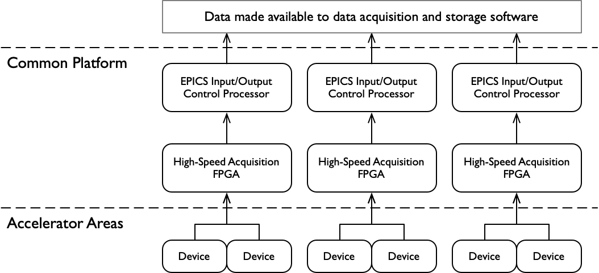

<html lang="en">

    

# Beam Synchronous Acquisition Service - User's Guide
    
Doug Murray, SLAC, May 2022 
Revision 1.0, 04-May-2022, Initial Version.

# System Overview

> **NOTE:**
> This document applies primarily to LCLS-II and devices associated with the Superconducting Linac.

This Beam Synchronous Acquisition Service (BSAS) records data from devices which are synchronized with a beam pulse, specifically with the timing signal that marks the presence of a beam pulse.  LCLS-I can provide beam at 120 Hz, while LCLS-II can provide beam up to 1 MHz.  This document deals with acquisition and recording of data from LCLS-II devices.
General purpose processors are not able to handle data directly at 1 MHz rates, so specialized components are used.  Field Programmable Gate Arrays (FPGAs) acquire the data directly from accelerator devices when enabled by the timing system.  That data is then made available to dedicated microprocessors, located in the same physical equipment housing the FPGA.  These processors are referred to as Input/Output Controllers (IOCs) using the EPICS control system toolkit.

<!-- . -->
<figure align="center">
	
	<figcaption><b>Figure 1.</b> FPGAs and EPICS IOCs Work to Acquire Data</figcaption>
</figure>

Although the FPGA can handle incoming data up to 1 MHz, it’s associated IOC is only able to process data up to 1 kHz.  Thus, if the beam rate is 1kHz or less, the IOC can successfully acquire all available data.
When beam rates are greater than 1kHz, the IOC still processes incoming data at 1 kHz.  In other words, with a beam rate of 1 MHz the IOC is only able to process a single value from each input every millisecond.  It will be missing 999 additional values from each input during that millisecond window.
Rather than simply ignoring the remaining data, each FPGA provides a millisecond-long summary of what was encountered.  That summary, along with a single representative sample acquired at the start of that millisecond, is given to the IOC.

<<diagram>>
Figure 2

In more specific terms, within each millisecond time window, each FPGA calculates the sum of each data input, the sum of each data input’s square, and also records the actual number of data inputs encountered during that millisecond, as well as the largest and smallest value seen for each input.  It then passes this summary along with the first data value encountered for each input in that millisecond to the IOC.

<<diagram>>
Figure 3

Each IOC then does a small calculation every millisecond when this data is received.  In addition to most of the original FPGA values, the IOC inserts the mean and the standard deviation for those data points encountered during the millisecond, for each input.  The full data summary consists of:
1)	Input Data Sample, providing a 1 kHz sample set overall
2)	Minimum data sample encountered by the FPGA during that millisecond
3)	Maximum data sample
4)	Number of data samples
5)	Mean value of sampled data
6)	Standard Deviation of sampled data
The IOC organizes these incoming summaries into tables; each input signal is represented as a set of six columns, and incoming data is added as a new row each millisecond.

<<diagram>>
Figure 4

When the beam rate is less than 1 MHz, the FPGA has a correspondingly greater time window.  The IOC will still generate a table of values each second.

# Access to Acquired Data
Offline access and online, live-time access
## Data File Location

### Copying Data

## Data File Structure
###  Data Format Details

> **Important:**
***The data includes a column incorrectly labeled RMS, which actually contains standard deviation data.***
The Root Mean Square (RMS) is the square root of the arithmetic mean of the squares of each of the data points, but the Standard Deviation is the square of the difference between each data point and the mean.

### Hierarchical Data Format (HDF)

### Time stamps and Beam Pulse IDs

## Programming Interfaces
### HDF Data Access from MATLAB

### HDF Data Access from Python

### HDF Data Access from C++

### Direct Live Data Access

#	System Operation
## Deployment Overview
Several instances of the BSAS-Merge software runs on lcls-srv01.
Associated instances of the BSAS-Write software currently runs on mccas0, but will soon run on machines such as **psana** or **iana**, on the S3DF cluster.

## Subsystem Operations
### BSAS Manager Process
 
